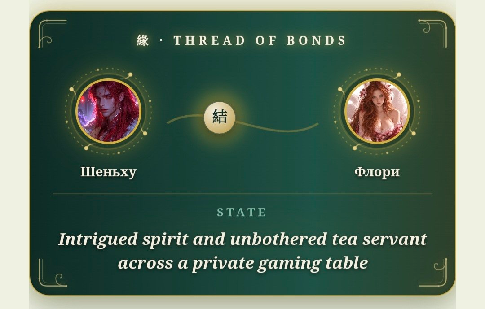

# 🪷 JADE IMMORTAL

**A modular TavoAI roleplay preset for immersive Ancient China** — historical realism, character autonomy, psychology, relationships, living NPCs, configurable magic systems and an interactive jade-themed UI rendered right in the chat.

<p>
  <a href="README.md">English</a> ·
  <a href="README.ru.md">Русский</a> ·
  <a href="README.zh-CN.md">中文</a>
</p>


---

## ✨ What it is

JADE IMMORTAL is a modular preset: you assemble your own game from toggles. The world runs on one rule — *everything the player sees is earned by the scene*: every interface element appears only when the story earns it.

- **🏯 Living world** — state, economy, society, culture, daily life of an imaginary empire.
- **🧠 Deep psychology** — hidden psyche, parallel scenes, a full relationship panel (JADE_BOND) with sliders, rings and the character's private inner voice.
- **☯ Configurable magic** — qi, yin-yang, five phases, cultivation, talismans, rituals, divination, feng shui, alchemy, immortality, spirits, yaoguai, hulijing, dragons, deities, omens. Every module is independent; the preset applies only what is enabled.
- **🖼 Interactive jade UI** — the model emits plain-text markers, a regex layer renders them into plaques: status compass header, bond panel, dossier mirror, thread of bonds, ink map, scrolls, sealed letters, inventory, clocks, diary pages, divination coins and more.
- **🎞 Optional scene illustrations** — FLASH/MIRROR/MOMENT image generation via your own proxy, NovelAI or NanoBanana (LinkAPI), 3 provider variants included.
- **🐢 Two relationship tempos** — slowburn (12-stage courtship) or fastburn, plus a dedicated intimate pacing module.

## 🌍 Three language versions

| Folder | Version | RP language | UI language |
|---|---|---|---|
| [`ru_ver/`](ru_ver/) | Русская | Russian | Russian |
| [`eng_ver/`](eng_ver/) | English | English | English |
| [`hanyu_ver/`](hanyu_ver/) | 中文版 | Chinese (书面语) | 中文 |

Each folder contains: the preset (`.json`) and two regex packs — `text` (18 files, the core UI) and `pics` (13 files, image-generation variants: PROXY / NAISTERA / LINK).

## 📦 Installation

1. **Preset**: TavoAI → Presets → Import → the `.json` of your language.
2. **Regexes**: import the `text` pack **in file order** (`tavo1` → `tavo18`). Order matters — separators and the thinking-tag renderer rely on it.
3. **Optional**: if you want scene illustrations, import the `pics` pack (choose ONE provider variant: PROXY, NAISTERA or LINK) and insert your token/URL where the placeholder says `INSERT_YOUR_TOKEN` / `INSERT_YOUR_URL` / `在此填入…` / `СЮДА_…`.
4. Enable the toggles you want. Everything is modular — a marker that has no active module is never emitted.

> Requires **TavoAI v0.93+** (Advanced Rendering). Thinking-tag (`<thinking>`) rendering must be enabled for the collapsible reasoning button.

## 🖼 The UI in action

**English version**

| Status header | Bond panel |
|---|---|
|  |  |

| Sealed letter | Thread of bonds |
|---|---|
|  |  |

**中文版**

| 顶栏 | 缘（关系面板） |
|---|---|
|  |  |

| 印信 | 因缘之线 |
|---|---|
|  |  |

## 🧩 Repository structure

```
├── ru_ver/     — русская версия (пресет + регексы)
├── eng_ver/    — English version (preset + regexes)
├── hanyu_ver/  — 中文版本 (预设 + 正则)
└── docs/screenshots/ — UI screenshots
```

## 🔗 Links

- 🌐 Site: [floryhibi.ru](https://floryhibi.ru)
- 💬 Discord: [discord.gg/zDH54uDArA](https://discord.gg/zDH54uDArA)
- 🐛 Bug report: [Google Form](https://docs.google.com/forms/d/e/1FAIpQLSeTuXpF4V8SlOUMPThsXINiW1bZ1xK3-gkIZnOMFRY5JI40Zg/viewform)

## 📄 License

[CC BY-NC-SA 4.0](LICENSE) — share and adapt freely for non-commercial use, with attribution (`@floryhibi`), under the same license.

---

*Made with 🪷 by [@floryhibi](https://github.com/floryhibi)*
