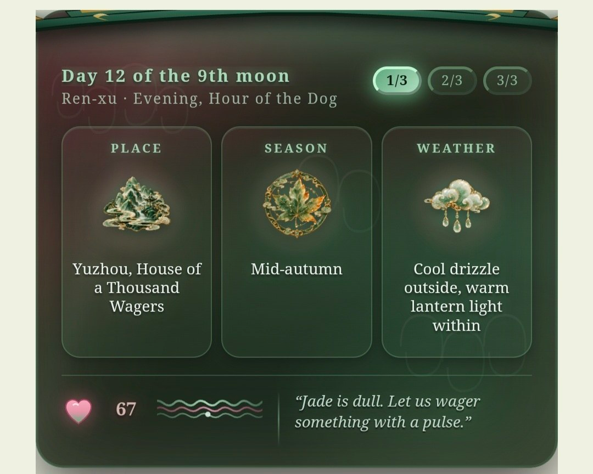
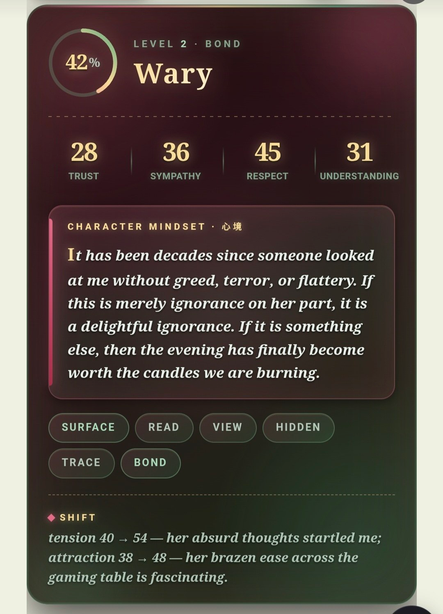

# 🪷 JADE IMMORTAL

**Модульный ролевой пресет для TavoAI — иммерсивный Древний Китай**: исторический реализм, автономия персонажей, психология, отношения, живые NPC, настраиваемые системы магии и интерактивный нефритовый интерфейс, который рисуется прямо в чате.

<p>
  <a href="README.md">English</a> ·
  <a href="README.ru.md">Русский</a> ·
  <a href="README.zh-CN.md">中文</a>
</p>


---

## ✨ Что это

JADE IMMORTAL — модульный пресет: вы собираете собственную игру из тогглов. Главное правило мира — *всё, что видит игрок, заслужено сценой*: каждый элемент интерфейса появляется только тогда, когда история его заработала.

- **🏯 Живой мир** — государство, экономика, общество, культура и быт вымышленной империи.
- **🧠 Глубокая психология** — скрытая психика, параллельные сцены, полноценная панель отношений (JADE_BOND) со слайдерами, кольцами и тайным внутренним голосом персонажа.
- **☯ Настраиваемая магия** — ци, инь-ян, у-син, культивация, талисманы, ритуалы, гадание, фэншуй, алхимия, бессмертие, духи, яогуаи, хулицзины, драконы, божества, знамения. Каждый модуль независим: пресет применяет только то, что включено.
- **🖼 Интерактивный нефритовый UI** — модель выводит текстовые маркеры, а слой регексов превращает их в плашки: шапка-компас, панель связи, зеркало-досье, нить отношений, карта тушью, свитки, запечатанные письма, инвентарь, часы, страницы дневника, гадальные монеты и другое.
- **🎞 Опциональные иллюстрации сцен** — генерация FLASH/ЗЕРКАЛО/МОМЕНТ через ваш прокси, NovelAI или NanoBanana (LinkAPI); три варианта провайдера в комплекте.
- **🐢 Два темпа отношений** — slowburn (ухаживание в 12 стадий) или fastburn, плюс отдельный модуль пейсинга близости.

## 🌍 Три языковые версии

| Папка | Версия | Язык RP | Язык UI |
|---|---|---|---|
| [`ru_ver/`](ru_ver/) | Русская | русский | русский |
| [`eng_ver/`](eng_ver/) | English | English | English |
| [`hanyu_ver/`](hanyu_ver/) | 中文版 | китайский (书面语) | 中文 |

В каждой папке: пресет (`.json`) и два пака регексов — `текст` (18 файлов, основной UI) и `картинки` (13 файлов, варианты генерации изображений: PROXY / NAISTERA / LINK).

## 📦 Установка

1. **Пресет**: TavoAI → Пресеты → Импорт → `.json` нужного языка.
2. **Регексы**: импортируйте текстовый пак **строго в порядке файлов** (`tavo1` → `tavo18`). Порядок важен — разделители и рендер думалки на него завязаны.
3. **Опционально**: если нужны иллюстрации, импортируйте пак картинок (выберите ОДИН провайдер: PROXY, NAISTERA или LINK) и вставьте свой токен/ссылку вместо плейсхолдеров `СЮДА_ВАШ_ТОКЕН` / `СЮДА_ССЫЛКУ`.
4. Включите нужные тогглы. Всё модульно: маркер без активного модуля никогда не появится.

> Требуется **TavoAI v0.93+** (Advanced Rendering). Для сворачивающейся кнопки рассуждений должен быть включён рендер тега `<thinking>`.

## 🖼 Интерфейс в деле

**Русская версия** — те же плашки, что в скриншотах ниже, с русскими подписями.

**English / 中文**

| Шапка-статус (EN) | Панель связи (EN) |
|---|---|
|  |  |

| Шапка (中文) | Панель 缘 (中文) |
|---|---|
|  |  |

Больше скриншотов — в [`docs/screenshots/`](docs/screenshots/).

## 🧩 Структура репозитория

```
├── ru_ver/     — русская версия (пресет + регексы)
├── eng_ver/    — English version (preset + regexes)
├── hanyu_ver/  — 中文版本 (预设 + 正则)
└── docs/screenshots/ — скриншоты интерфейса
```

## 🔗 Ссылки

- 🌐 Сайт: [floryhibi.ru](https://floryhibi.ru)
- 💬 Discord: [discord.gg/zDH54uDArA](https://discord.gg/zDH54uDArA)
- 🐛 Баг-репорт: [Google Form](https://docs.google.com/forms/d/e/1FAIpQLSeTuXpF4V8SlOUMPThsXINiW1bZ1xK3-gkIZnOMFRY5JI40Zg/viewform)

## 📄 Лицензия

[CC BY-NC-SA 4.0](LICENSE) — можно делиться и адаптировать в некоммерческих целях с указанием авторства (`@floryhibi`) и сохранением той же лицензии.

---

*Сделано с 🪷 — [@floryhibi](https://github.com/floryhibi)*
