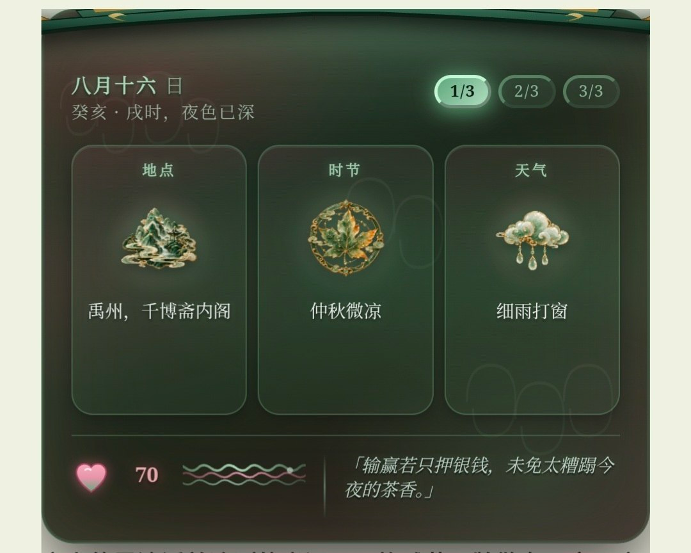
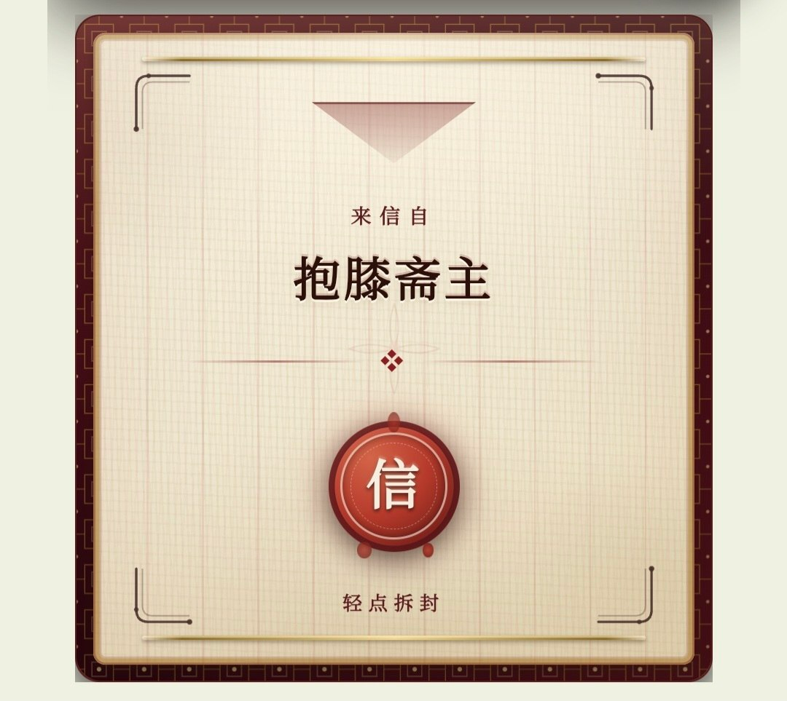
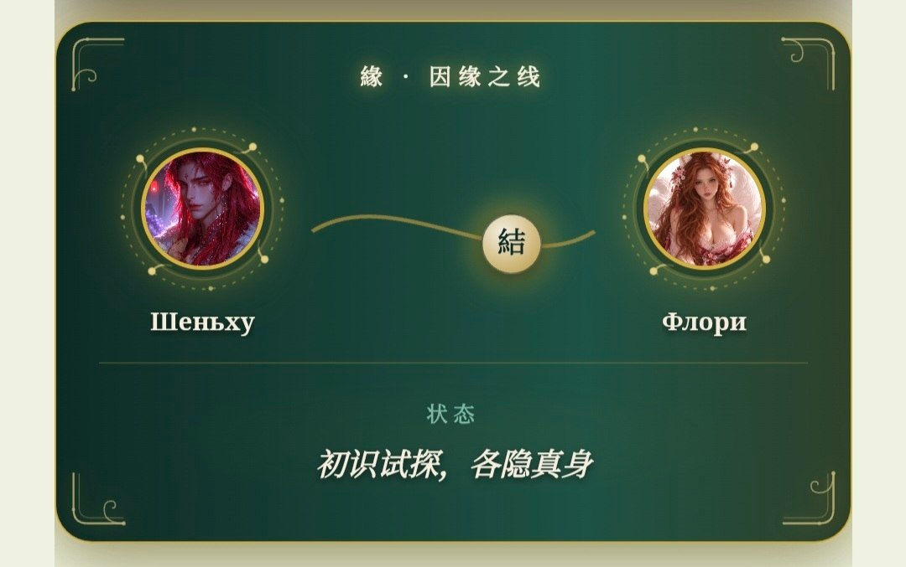

# 🪷 JADE IMMORTAL · 玉长生

**TavoAI 模块化角色扮演预设 — 沉浸式古代中国**：历史质感、角色自主性、心理刻画、人际关系、鲜活的 NPC、可自由组合的法术体系，以及直接在聊天中渲染的互动玉石界面。

<p>
  <a href="README.md">English</a> ·
  <a href="README.ru.md">Русский</a> ·
  <a href="README.zh-CN.md">中文</a>
</p>


---

## ✨ 这是什么

JADE IMMORTAL 是模块化预设：你用开关自由拼装自己的游戏。世界只有一条铁律——*玩家所见，皆由剧情挣来*：每个界面元素只在故事配得上它的时候出现。

- **🏯 鲜活的天下** — 虚构王朝的朝政、经济、社会、文化与起居日常。
- **🧠 深层心理** — 潜藏心境、平行场景、完整的关系面板（JADE_BOND）：滑条、圆环，以及角色不曾宣之于口的心声。
- **☯ 可组合的法术体系** — 气、阴阳、五行、修炼、符箓、祭祀、占卜、风水、丹术、长生、神祇、妖怪、狐狸精、龙、天神、征兆。每个模块彼此独立，预设只启用你打开的部分。
- **🖼 互动玉石界面** — 模型输出纯文本标记，正则层将其渲染成界面：顶栏罗盘、缘之面板、镜鉴档案、因缘之线、水墨舆图、卷轴、封印信、行囊、更漏、日记页、占卜钱币等等。
- **🎞 可选场景插图** — 画面/镜鉴/片刻 的图像生成，支持自有反代、NovelAI 或 NanoBanana（LinkAPI），附三种接入方案。
- **🐢 两种感情节奏** — 慢燃（十二阶相知）或速燃，另有专门的亲密节奏模块。

## 🌍 三个语言版本

| 文件夹 | 版本 | RP 语言 | 界面语言 |
|---|---|---|---|
| [`ru_ver/`](ru_ver/) | Русская | 俄语 | 俄语 |
| [`eng_ver/`](eng_ver/) | English | English | English |
| [`hanyu_ver/`](hanyu_ver/) | 中文版 | 中文（书面语） | 中文 |

每个文件夹内含：预设（`.json`）与两个正则可导入包——`text`（18 个文件，核心界面）与 `pics`（13 个文件，图像生成三方案：PROXY / NAISTERA / LINK）。

## 📦 安装

1. **预设**：TavoAI → 预设 → 导入 → 选择对应语言的 `.json`。
2. **正则**：按文件顺序导入 `text` 包（`tavo1` → `tavo18`）。顺序很重要——分隔符与思维标签的渲染依赖它。
3. **可选**：如需场景插图，导入 `pics` 包（三种方案任选其一：PROXY、NAISTERA 或 LINK），并在写着 `在此填入你的TOKEN` / `在此填入你的链接` 的位置填入你的令牌/链接。
4. 按需打开开关。完全模块化：没有对应模块的标记永远不会出现。

> 需要 **TavoAI v0.93+**（Advanced Rendering）。可折叠的思维按钮需要启用 `<thinking>` 标签渲染。

## 🖼 界面一览

| 顶栏 | 缘（关系面板） |
|---|---|
|  |  |

| 印信 | 因缘之线 |
|---|---|
|  |  |

英文版界面见 [`docs/screenshots/`](docs/screenshots/)。

## 🧩 仓库结构

```
├── ru_ver/     — 俄语版（预设 + 正则）
├── eng_ver/    — 英文版（预设 + 正则）
├── hanyu_ver/  — 中文版（预设 + 正则）
└── docs/screenshots/ — 界面截图
```

## 🔗 链接

- 🌐 网站：[floryhibi.ru](https://floryhibi.ru)
- 💬 Discord：[discord.gg/zDH54uDArA](https://discord.gg/zDH54uDArA)
- 🐛 问题反馈：[Google 表单](https://docs.google.com/forms/d/e/1FAIpQLSeTuXpF4V8SlOUMPThsXINiW1bZ1xK3-gkIZnOMFRY5JI40Zg/viewform)

## 📄 许可

[CC BY-NC-SA 4.0](LICENSE) — 可非商业性地分享与改编，须署名（`@floryhibi`）并以相同许可发布。

---

*由 [@floryhibi](https://github.com/floryhibi) 以 🪷 制作*
